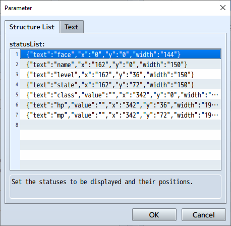

[Return to Top Page](README.md)

# [FTKR_CustomSimpleActorStatus](FTKR_CustomSimpleActorStatus.js) Plugin

This plugin allows you to customize the display of actor statuses.

Download: [FTKR_CustomSimpleActorStatus.js](https://raw.githubusercontent.com/leo7oo/RPGMaker/refs/heads/master/FTKR_CustomSimpleActorStatus.js)

# Table of Contents

The following sections explain how to use the plugin:
1. [Overview](#overview)
2. [Plugin Registration](#plugin-registration)
3. [Basic Settings](#basic-settings)
    1. [Basic Layout Structure](#basic-layout-structure)
    2. [Displayable Statuses](#displayable-statuses)
4. [Layout Settings](FTKR_CustomSimpleActorStatus_1.md)
    1. [Manipulating statusList](FTKR_CustomSimpleActorStatus_1.md#manipulating-statuslist)
    2. [Setting statusList Parameters](FTKR_CustomSimpleActorStatus_1.md#setting-statuslist-parameters)
    3. [Other Settings](FTKR_CustomSimpleActorStatus_1.md#other-settings)
5. [Displaying Statuses](FTKR_CustomSimpleActorStatus_2.md)
    1. [Displaying Face Images](FTKR_CustomSimpleActorStatus_2.md#displaying-face-images)
    2. [Displaying Walking Character Images](FTKR_CustomSimpleActorStatus_2.md#displaying-walking-character-images)
    3. [Displaying SV Battle Character Images](FTKR_CustomSimpleActorStatus_2.md#displaying-sv-battle-character-images)
    4. [Displaying State Icons](FTKR_CustomSimpleActorStatus_2.md#displaying-state-icons)
    5. [Displaying Parameter Differences](FTKR_CustomSimpleActorStatus_2.md#displaying-parameter-differences)
    6. [Displaying Equipment Parameters](FTKR_CustomSimpleActorStatus_2.md#displaying-equipment-parameters)
    7. [Displaying AOP Equipment Parameters](FTKR_CustomSimpleActorStatus_2.md#displaying-aop-equipment-parameters)
    8. [Displaying Custom Parameters](FTKR_CustomSimpleActorStatus_2.md#displaying-custom-parameters)
    9. [Displaying Custom Gauges](FTKR_CustomSimpleActorStatus_2.md#displaying-custom-gauges)
    10. [Displaying Custom Images](FTKR_CustomSimpleActorStatus_2.md#displaying-custom-images)
    11. [Displaying Actor-Specific Custom Gauges](FTKR_CustomSimpleActorStatus_2.md#displaying-actor-specific-custom-gauges)
    12. [Displaying Class-Specific Custom Gauges](FTKR_CustomSimpleActorStatus_2.md#displaying-class-specific-custom-gauges)
    13. [Displaying Messages](FTKR_CustomSimpleActorStatus_2.md#displaying-messages)
* [Plugin Update History](#plugin-update-history)
* [Extension Plugins](#extension-plugins)
* [License](#license)

# Overview

This plugin implements detailed customization for the layout of actor status displays.

By combining this plugin with its extension plugins (FTKR_CSS_***.js), you can customize various status screens such as the menu screen and battle screen.

The setup method varies depending on the plugin version. For v2.x.x, refer to [this document](FTKR_CustomSimpleActorStatus_old.en.md).

[Return to Table of Contents](#table-of-contents)

# Plugin Registration

When using this plugin in combination with the following plugins, ensure they are registered in the plugin manager in the following order:
```
YEP_BuffsStatesCore.js
FTKR_CustomSimpleActorStatus.js
FTKR_CSS_***.js
FTKR_ExSvMotion.js
FTKR_FacialImageDifference.js
```

[Return to Table of Contents](#table-of-contents)

# Basic Settings

## Basic Layout Structure

The layout of the status window is configured using the plugin parameter `statusList`. This parameter is set in the extension plugin (FTKR_CSS_***.js).

`statusList` is structured as a list. Each element in the list specifies which status to display and where.

The following example shows a setup for displaying 7 statuses (face, name, level, state, class, hp, mp).

You can add as many statuses as you want to the list.



The elements of the `statusList` parameter are as follows:
* **text**: Specifies the [status to display](#displayable-statuses).
* **value**: The content to input varies depending on the status being displayed.
* **x**: Specifies the X-coordinate of the status within the window.
* **y**: Specifies the Y-coordinate of the status within the window.
* **width**: Specifies the display width of the status.


By setting these parameters, the status window in the menu screen and other screens will reflect the changes.


[Return to Table of Contents](#table-of-contents)

## Displayable Statuses

Below is a list of statuses that can be configured in the `statusList` parameter.

* **text** and **value** are the inputs for the plugin parameter.
* If **value** is `-`, no input is required.
* The string entered in **text** is case-insensitive.
* You can also input scripts for **value**.
* Statuses with ○ in the control character column can use control characters in their displayable content.

### Actor-Specific Codes

Some codes can also be displayed for enemies.

| Status Name | text | value | Control Char | Description |
| ----------- | ----- | ---- | ---- | ---- |
| Name | name | - | - | Displays the actor's name. |
| Nickname | nickname | - | - | Displays the actor's nickname. |
| Class | class | - | - | Displays the actor's class. |
| Level | level | - | - | Displays the actor's current level. |
| HP | hp | - | - | Displays the actor's current HP, max HP, and HP gauge. |
| MP | mp | - | - | Displays the actor's current MP, max MP, and MP gauge. |
| TP | tp | - | - | Displays the actor's current TP and TP gauge. |
| [Face Image](FTKR_CustomSimpleActorStatus_2.md#face-image-display) | face <br> face(%1) | - <br> row number | - | Displays the actor's face image. |
| [Walking Character Image](FTKR_CustomSimpleActorStatus_2.md#character-image-display) | chara | - | - | Displays the actor's walking character image (front view). |
| [SV Battle Character Image](FTKR_CustomSimpleActorStatus_2.md#sv-battle-character-image-display) | sv | - | - | Displays the actor's SV battle character image. |
| [State Icons](FTKR_CustomSimpleActorStatus_2.md#state-icon-display)) | state <br> state2(%1) | - <br> row number | - | Displays the icons of states applied to the actor in a row. |
| Profile | profile | - | ○ | Displays the actor's profile. The profile automatically expands the drawing area to fit the content. |
| Basic Parameters | param(%1) | x | - | Displays the name and value of basic parameters such as attack and defense. <br> The number **x** corresponds to the following parameters: <br> 0 - Max HP, 1 - Max MP, 2 - Attack, 3 - Defense <br> 4 - Magic Attack, 5 - Magic Defense, 6 - Agility, 7 - Luck |
| Base Parameters | pbase(%1) | x | - | Displays the name and base value of basic parameters, excluding equipment and trait adjustments. <br> The number **x** is the same as for **param**. |
| [Parameter Differences](FTKR_CustomSimpleActorStatus_2.md#parameter-difference-display) | pdiff(%1) | x | ○ | Displays the increase or decrease in basic parameters due to equipment and traits. <br> The number **x** is the same as for **param**. <br> Increases are displayed in green, decreases in red. |
| Additional Parameters | xparam(%1) | x | - | Displays the name and value of additional parameters such as hit rate and evasion rate. <br> The number **x** corresponds to the following parameters: <br> 0 - Hit Rate, 1 - Evasion Rate, 2 - Critical Rate, 3 - Critical Evasion Rate <br> 4 - Magic Evasion Rate, 5 - Magic Reflection Rate, 6 - Counter Rate, 7 - HP Regeneration Rate <br> 8 - MP Regeneration Rate, 9 - TP Regeneration Rate <br> The display format (decimal or percentage) can be selected in the plugin parameter `Disp Decimals Param`. <br> Parameter names can be set in the plugin parameter `XPARAM Name`. |
| Special Parameters | sparam(%1) | x | - | Displays the name and value of special parameters such as target rate and defense effect rate. <br> The number **x** corresponds to the following parameters: <br> 0 - Target Rate, 1 - Defense Effect Rate, 2 - Recovery Effect Rate, 3 - Pharmacy Knowledge <br> 4 - MP Consumption Rate, 5 - TP Charge Rate, 6 - Physical Damage Rate <br> 7 - Magic Damage Rate, 8 - Floor Damage Rate, 9 - EXP Gain Rate <br> The display format (decimal or percentage) can be selected in the plugin parameter `Disp Decimals Param`. <br> Parameter names can be set in the plugin parameter `SPARAM Name`. |
| Equipment | equip(%1) | x | - | Displays the name and icon of equipment. <br> **x** indicates the equipment type number. <br> In the shop screen, entering `shop` in **value** will display the equipment slot corresponding to the currently selected item. |
| [Equipment Parameters](FTKR_CustomSimpleActorStatus_2.md#equipment-parameter-display) | eparam(%1) | x | - | Displays the value of basic parameters after equipment changes. <br> The number **x** is the same as for **param**. |
| Equipment Additional Parameters | exparam(%1) | x | - | Displays the value of additional parameters after equipment changes. <br> The number **x** is the same as for **xparam**. |
| Equipment Special Parameters | esparam(%1) | x | - | Displays the value of special parameters after equipment changes. <br> The number **x** is the same as for **sparam**. |
| Unequippable Display | notequip(%1) | x | ○ | Displays the specified text **x** when the selected equipment item cannot be equipped by the actor. If **x** is blank, "Cannot Equip" is displayed. <br> Can be used in windows that reference item data (e.g., shop screen). |
| [Custom Parameters](FTKR_CustomSimpleActorStatus_2.md#custom-parameter-display) | custom(%1) | x | ○ | Displays parameters set in the plugin parameters. <br> The number **x** is the custom parameter ID. |
| [Custom Gauges](FTKR_CustomSimpleActorStatus_2.md#custom-gauge-display)) | gauge(%1) | x | ○ | Displays gauges set in the plugin parameters. <br> The number **x** is the custom gauge ID. |
| [Actor-Specific Custom Gauges](FTKR_CustomSimpleActorStatus_2.md#actor-specific-custom-gauge-display) | agauge(%1) | x | ○ | Displays gauges set in the actor's note field. <br> The number **x** is the custom gauge ID. |
| [Class-Specific Custom Gauges](FTKR_CustomSimpleActorStatus_2.md#class-specific-custom-gauge-display) | cgauge(%1) | x | ○ | Displays gauges set in the class's note field. <br> The number **x** is the custom gauge ID. |
| [Custom Images](FTKR_CustomSimpleActorStatus_2.md#custom-image-display) | image <br> image(%1) | - <br> image ID | - | Displays images set in the actor's note field. |
| [Messages](FTKR_CustomSimpleActorStatus_2.md#message-display) | message | - | ○ | Displays messages based on changes in the actor's state. |

#### Actor-Specific Special 1

The following codes require the [FTKR_AddOriginalParameters plugin](FTKR_AddOriginalParameters.en.md).

| Status Name | text | value | Control Char | Description |
| ----------- | ----- | ---- | ---- | ---- |
| AOP Parameters | aop(%1) | x | - | Displays the name and value of original parameters. <br> The number **x** is the original parameter ID. |
| Base AOP Parameters | aopbase(%1) | x | - | Displays the name and base value of original parameters, excluding equipment and trait adjustments. <br> The number **x** is the same as for **aop**. |
| [AOP Parameter Differences](FTKR_CustomSimpleActorStatus_2.md#displaying-parameter-differences) | aopdiff(%1) | x | ○ | Displays the increase or decrease in original parameters due to equipment and traits. <br> The number **x** is the same as for **aop**. <br> Increases are displayed in green, decreases in red. |
| [AOP Equipment Parameters](FTKR_CustomSimpleActorStatus_2.md#displaying-aop-equipment-parameters) | eaop(%1) | x | - | Displays the value of original parameters after equipment changes. <br> The number **x** is the same as for **aop**. |

#### Actor-Specific Special 2

The following codes require the [FTKR_CSS_ShopStatus plugin](FTKR_CSS_ShopStatus.en.md). <br>
These codes have been standard since v3.4.0 of FTKR_CustomSimpleActorStatus.

| Status Name | text | value | Control Char | Description |
| ----------- | ----- | ---- | ---- | ---- |
| [Equipment Parameter Differences](FTKR_CustomSimpleActorStatus_2.md#parameter-difference-display) | ediff(%1) | x | ○ | Displays the increase or decrease in basic parameters due to equipment and traits after equipment changes. <br> The number **x** is the same as for **eparam**. <br> Increases are displayed in green, decreases in red. |
| Equipment Additional Parameter Differences | exdiff(%1) | x | ○ | Displays the increase or decrease in additional parameters due to equipment and traits after equipment changes. <br> The number **x** is the same as for **exparam**. <br> Increases are displayed in green, decreases in red. |
| Equipment Special Parameter Differences | esdiff(%1) | x | ○ | Displays the increase or decrease in special parameters due to equipment and traits after equipment changes. <br> The number **x** is the same as for **esparam**. <br> Increases are displayed in green, decreases in red. |
| [AOP Equipment Parameter Differences](FTKR_CustomSimpleActorStatus_2.md#parameter-difference-display) | eaopdiff(%1) | x | ○ | Displays the increase or decrease in original parameters due to equipment and traits after equipment changes. <br> The number **x** is the same as for **aop**. <br> Increases are displayed in green, decreases in red. |

#### Actor-Specific Special 3

The following codes require the [FTKR_CSS_CustomizeBattleResults plugin](FTKR_CSS_CustomizeBattleResults.en.md).

| Status Name | text | value | Control Char | Description |
| ----------- | ----- | ---- | ---- | ---- |
| Message 2 | message2 | - | ○ | Displays the content of the **message** code along with a message for skill acquisition upon level-up. <br> Requires 2 lines for display. |

#### Actor-Specific Special 4

The following codes require the [FTKR_SkillTreeSystem plugin](FTKR_SkillTreeSystem.en.md).

| Status Name | text | value | Control Char | Description |
| ----------- | ----- | ---- | ---- | ---- |
| Skill Points | sp | - | - | Displays the actor's skill points. |

#### Actor-Specific Special 5

The following codes require the [FTKR_AlternatingTurnBattle plugin](FTKR_AlternatingTurnBattle.en.md).

| Status Name | text | value | Control Char | Description |
| ----------- | ----- | ---- | ---- | ---- |
| Action Count | actc | - | - | Displays the actor's action count. |
| Action Points | actp | - | - | Displays the party's action points. |

### General Codes

The following codes display parameters for entities other than actors.

| Status Name | text | value | Control Char | Description |
| ----------- | ----- | ---- | ---- | ---- |
| Text | text(%1) | x | ○ | Displays the string **x**. <br> **x** can be a parameter reference code. <br> For example, `text($dataItems[1].name)` displays the name of item ID 1. |
| JS Expression | eval(%1) | x | - | Evaluates the string **x** using the JS function `eval()` and displays the result as a number. |
| JS String Expression | streval(%1) | x | - | Evaluates the string **x** using the JS function `eval()` and displays the result as a string. |
| Draw Horizontal Line | line | - | - | Draws a horizontal line. |
| Map Display Name | mapname | - | - | Displays the current map's display name. |

### Item-Specific Codes

The following codes display parameters for items rather than actors. <br>
Items here include weapons, armor, and skills. <br>
These codes can be used in windows that reference item data (e.g., shop screen).

| Status Name | text | value | Control Char | Description |
| ----------- | ----- | ---- | ---- | ---- |
| Item Name | iname | - | - | Displays the item's name. |
| Item Icon | iicon | - | - | Displays the item's icon. |
| Item Description | idesc | - | ○ | Displays the item's description using 2 lines. |
| Item Type | itype | - | - | Displays the item's type. |
| Item Equipment Type | ietype | - | - | Displays the item's equipment type (for weapons and armor only). |
| Item Scope | iscope | - | - | Displays the item's scope (for items and skills only). |
| Item Element | ielement | - | - | Displays the item's element (for items and skills only). |
| Item Parameter | iparam(%1) | x | - | Displays the data of the property specified by the string **x**. |
| Item Custom Image | iimage(%1) | x | - | Displays the custom image ID **x** set for the item. |
| Item Quantity | inumber | - | - | Displays the quantity of the item (for items, weapons, and armor only). |

### Item-Specific Special Codes

The following codes require the [FTKR_STS_CustomSkillStatus plugin](FTKR_STS_CustomSkillStatus.en.md). <br>
These codes can only be used in the skill tree window.

| Status Name | text | value | Control Char | Description |
| ----------- | ----- | ---- | ---- | ---- |
| Skill Acquisition Cost | istscost(%1) | x | - | Displays the skill acquisition cost in the skill tree. <br> **x** specifies the cost number. <br> If multiple costs are set, they are counted from the top of the note field as 0, 1, 2, etc. |
| Skill Acquisition Count | istscount | - | - | Displays the number of times the skill has been acquired in the skill tree. |

[Return to Table of Contents](#table-of-contents)

# Plugin Update History

| Version | Release Date | Update Details |
| --- | --- | --- |
| [ver3.5.3](FTKR_CustomSimpleActorStatus.js) | 2019/05/12 | Added code to display item quantity (numItem). <br> Added special processing for the shop screen to the equipment display code (equip(%1)). |
| ver3.5.2 | 2019/04/14 | Added codes to display special parameters (xparam) and additional parameters (sparam). |
| ver3.5.1 | 2019/03/05 | Fixed a bug where the "value" parameter in the extension plugin's "statusList" was not read correctly. <br> Added the **notequip** parameter to display specific text when the selected equipment cannot be equipped. (Can be used in the equipment and shop screens.) |
| ver3.5.0 | 2018/12/29 | Added a plugin command to change saved window settings (FTKR_CSS_BattleStatus). |
| ver3.4.7 | 2018/12/27 | Fixed a bug in FTKR_CSS_ShopStatus v2.2.2. <br> Fixed a bug where item data images were not displayed in FTKR_OriginalSceneWindow. |
| ver3.4.6 | 2018/12/15 | Revised the display processing for custom parameters and custom gauges. <br> Revised the judgment processing for plugin commands. |
| ver3.4.5 | 2018/12/13 | Revised the processing to avoid always evaluating code(x) parameters with `eval()`. |
| ver3.4.4 | 2018/12/02 | Fixed a bug where specifying a non-existent image ID in custom images caused an error. |
| ver3.4.3 | 2018/11/03 | Separated the display settings for **ediff(x)**, **aopdiff(x)**, and **ediffaop(x)** from **pdiff(x)**. |
| ver3.4.2 | 2018/10/28 | Fixed a bug where original parameters and original gauge values were not displayed correctly in some scenes. |
| ver3.4.1 | 2018/10/11 | Added a feature to disable control characters in parameter difference displays. <br> Changed parameter difference displays to hide values of 0. |
| ver3.4.0 | 2018/10/10 | Moved **ediff(x)** and **ediffaop(x)** codes from FTKR_CSS_ShopStatus. |
| ver3.3.4 | 2018/09/29 | Added codes for displaying AOP parameters. |
| ver3.3.3 | 2018/09/28 | Added codes for displaying parameters. |
| ver3.3.2 | 2018/09/19 | Added item-specific codes. |
| ver3.3.1 | 2018/09/19 | Fixed a bug where state icons were not displayed when the actor was incapacitated. |
| ver3.3.0 | 2018/09/15 | Added item-specific codes. <br> Added a feature to set the margin between state icons. <br> Changed state icons to display at least one icon even if the height or width is insufficient. <br> Changed the size adjustment to work even when the display width is small if the plugin parameter **Enable Auto Scale** is enabled. |
| ver3.2.0 | 2018/09/11 | Revised descriptions for FTKR_GDM_WindowEditor.js. |
| ver3.1.1 | 2018/09/09 | Removed descriptions for GraphicalDesignMode.js. |
| ver3.1.0 | 2018/08/30 | Added a feature to select displayable statuses in a list in the extension plugin's parameters. |
| ver3.0.2 | 2018/08/25 | Fixed a bug where settings were invalidated when margin and background opacity were set to 0 in the extension plugin. |
| ver3.0.1 | 2018/08/20 | Fixed a bug where enabling status window settings in the extension plugin caused errors. |
| ver3.0.0 | 2018/08/19 | Adopted a per-status display position specification method for status display and parameter input. <br> Revised for compatibility with FTKR_GDM_WindowEditor. <br> Added a feature to adjust the size of face images. |
| [ver2.7.2](archive/FTKR_CustomSimpleActorStatus_2.7.2.js) | 2018/08/18 | Fixed a bug where state icons were not displayed when using the extension plugin. |
| ver2.7.1 | 2018/08/17 | Fixed a bug where state icons were displayed even when the status window was hidden in the battle scene. |
| ver2.7.0 | 2018/03/17 | Added a plugin command to change custom images during gameplay. |
| ver2.6.3 | 2018/03/12 | Separated the opacity judgment for face images and custom images into a function. <br> Added exception handling for cases where no actor is set in the code processing section. |
| ver2.6.2 | 2018/03/11 | Fixed a bug where codes set in square brackets were not displayed correctly. <br> Fixed a bug where state icon displays were not fully updated when changing the **state** code in design mode. |
| ver2.6.1 | 2018/01/07 | Separated the X-coordinate alignment for face images, walking characters, and SV characters into a function. |
| ver2.6.0 | 2017/11/18 | Added compatibility with GraphicalDesignMode.js for FTKR_CSS_***Status extension plugins. |
| ver2.5.1 | 2017/11/08 | Fixed a bug where scenes would error on startup if a window created by FTKR_OriginalSceneWindow.js was present. |
| ver2.5.0 | 2017/11/08 | Added a code to display horizontal lines. <br> Added a feature to change layouts in-game during design mode using GraphicalDesignMode.js and FTKR_CSS_GDM.js. |
| ver2.4.3 | 2017/11/02 | Fixed a bug where the equipment screen would freeze. |
| ver2.4.2 | 2017/11/01 | Fixed a bug where custom parameters and custom gauges did not display names. <br> Fixed a bug where equipment parameters were not displayed. |
| ver2.4.1 | 2017/10/16 | Fixed a bug where the display position would shift when using control characters in custom parameters and custom gauges. |
| ver2.4.0 | 2017/10/16 | Changed custom gauges to display strings for current and max values. |
| ver2.3.0 | 2017/07/23 | Revised the judgment processing for display codes. <br> Allowed scripts to be specified instead of numbers for display codes with parentheses. <br> Added the **eaop(x)** code to display equipment parameters for original parameters created with FTKR_AddOriginalParameters. |
| ver2.2.0 | 2017/06/20 | Added JS expression evaluation processing to the text code. <br> Added a feature to display JS expression evaluation results as strings. |
| ver2.1.0 | 2017/06/19 | Changed the custom image setup specifications. <br> Added a feature to set multiple custom images. |
| ver2.0.0 | 2017/06/18 | Removed the menu screen layout change feature. |
| [ver1.8.0](archive/FTKR_CustomSimpleActorStatus_1.8.0.js) | 2017/06/17 | Added a feature to display units for custom parameters. |
| ver1.7.6 | 2017/06/10 | Fixed a bug where state count displays were not updated correctly when combined with YEP_BuffsStatesCore.js. |
| ver1.7.5 | 2017/06/10 | Fixed a bug where control characters in the text code were not displayed correctly. |
| ver1.7.4 | 2017/06/09 | Added compatibility with YEP_BuffsStatesCore.js. |
| ver1.7.3 | 2017/06/08 | Added a feature to revert state icon display processing to MV's default. |
| ver1.7.2 | 2017/06/07 | Fixed a bug where curly braces did not correctly expand the drawing area. <br> Added a code to display JS calculation results using `eval()`. <br> Added a code to display level-up messages. |
| ver1.7.1 | 2017/06/05 | Fixed a bug where walking characters were not displayed correctly. <br> Added a feature to align walking character directions with the map's player. <br> Added a feature to disable SV character motions. <br> Added a feature to adjust the position of custom images. |
| ver1.7.0 | 2017/06/02 | Added actor-specific custom gauges. <br> Added class-specific custom gauges. <br> Fixed a bug where the skill screen's status section was not displayed when the plugin parameter **Enabled Skill Status** was disabled. |
| ver1.6.0 | 2017/06/01 | Revised the adjustment features for custom gauge displays. <br> Added a feature to hide custom gauge bars. <br> Added a feature to set custom gauges to display specified values instead of current and max values. |
| ver1.5.3 | 2017/05/13 | Added the **eparam** code to display parameters in the equipment screen. |
| ver1.5.2 | 2017/05/12 | Fixed a bug where expanding the drawing area for horizontally aligned actors also expanded the display area of adjacent actors. <br> Added a feature to adjust image display positions. |
| ver1.5.1 | 2017/05/11 | Fixed a bug where errors occurred if the party had fewer members than the status window could display. |
| ver1.5.0 | 2017/05/10 | Added compatibility with FTKR_FacialImageDifference.js. |
| [ver1.4.4](/archive/FTKR_CustomSimpleActorStatus_1.4.4.js) | 2017/05/08 | Fixed a bug where actor sprites in the menu screen were not updated correctly. |
| ver1.4.3 | 2017/05/06 | Fixed a bug where face images were not displayed correctly when actors were aligned horizontally. <br> Added a feature to set vertical cursor spacing. |
| ver1.4.2 | 2017/05/04 | Applied actor self-variables to custom parameters and custom gauges. |
| ver1.4.1 | 2017/04/25 | Fixed a bug where SV character positions shifted after escaping from battle. |
| ver1.4.0 | 2017/04/21 | Separated display change features for non-menu screens into extension plugins. <br> Changed the face image display specifications. <br> Changed the tag specifications for custom images. <br> Added a feature to change the settings of the menu screen's simple status window. |
| [ver1.3.1](/archive/FTKR_CustomSimpleActorStatus_1.3.1.js) | 2017/04/21 | Added compatibility with FTKR_ExSvMotion.js. |
| ver1.3.0 | 2017/04/19 | Changed the state icon display specifications. |
| [ver1.2.5](/archive/FTKR_CustomSimpleActorStatus_1.2.5.js) | 2017/04/15 | Adjusted the display position of state icons. <br> Added a feature to adjust state icon sizes according to row height. |
| ver1.2.4 | 2017/04/12 | Revised the scaling processing for face images. |
| ver1.2.3 | 2017/04/11 | Revised the help section. |
| ver1.2.2 | 2017/04/11 | Added features and started publishing on GitHub. |
| ver1.2.1 | 2017/04/01 | Removed and added features, published on [Tukimate](http://tm.lucky-duet.com/viewtopic.php?f=5&t=3305). |
| ver1.0.0 | 2017/03/09 | Initial version, published on [Tukimate](http://tm.lucky-duet.com/viewtopic.php?f=5&t=3305). |

If using an older version, remove the version part from the file name (the part in brackets in FTKR_CustomSimpleActorStatus[_1.x.x].js).

# Extension Plugins

The following plugins can be used to extend the functionality of this plugin.

* [FTKR_CSS_MenuStatus](FTKR_CSS_MenuStatus.en.md) - Allows customization of the menu screen's status layout.
* [FTKR_CSS_BattleStatus](FTKR_CSS_BattleStatus.en.md) - Allows customization of the battle screen's status layout.
* [FTKR_CSS_DetailedStatus](FTKR_CSS_DetailedStatus.en.md) - Allows customization of the status screen's status layout.
* [FTKR_CSS_EquipStatus](FTKR_CSS_EquipStatus.en.md) - Allows customization of the equipment screen's status layout.
* [FTKR_CSS_SkillStatus](FTKR_CSS_SkillStatus.en.md) - Allows customization of the skill screen's status layout.
* [FTKR_CSS_CustomizeBattleResults](FTKR_CSS_CustomizeBattleResults.en.md) - Displays a battle results screen after battle.
* [FTKR_CSS_ShopStatus](FTKR_CSS_ShopStatus.en.md) - Allows customization of the shop screen's status layout.

* [FTKR_AddOriginalParameters](FTKR_AddOriginalParameters.en.md) - Allows creation of original parameters for actors, usable in custom parameters and custom gauges.
* [FTKR_ExSvMotion.js](FTKR_ExSvMotion.en.md) - Adds or changes motions when states are applied.
* [FTKR_ItemSelfVariables.js](FTKR_ItemSelfVariables.en.md) - Adds actor self-variables usable in custom parameters and custom gauges.
* [FTKR_FTKR_FacialImageDifference.js](FTKR_FTKR_FacialImageDifference.en.md) - Changes face images based on the actor's state.

# License

This plugin is released under the MIT License.

[The MIT License (MIT)](https://opensource.org/licenses/mit-license.php)

#

[Return to Table of Contents](#table-of-contents)

[Return to Top Page](README.md)
