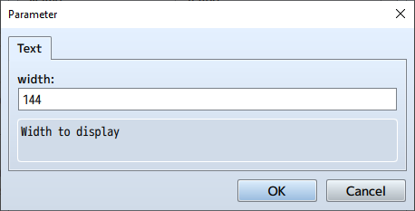

[Return to Top Page](README.md)  
[Return to Table of Contents](FTKR_CustomSimpleActorStatus.ja.md#table-of-contents)

# Layout Settings

1. [Manipulating `statusList`](#manipulating-statuslist)
2. [Setting `statusList` Parameters](#setting-statuslist-parameters)
    1. [Setting the Status to Display](#setting-the-status-to-display)
    2. [Setting the Display Position and Width](#setting-the-display-position-and-width)
3. [Other Settings](#other-settings)

## Manipulating `statusList`

### Editing Existing Status

To edit an existing status, double-click on the status you want to edit.

### Deleting Existing Status

To delete an existing status, select the status you want to delete and press the `Delete` key.

If you cancel the plugin parameter window after deleting, the status will be restored.

### Copying Existing Status

You can select multiple statuses at once by holding the `Shift` key while selecting the statuses with the cursor.

The selected statuses can be copied using `Ctrl + c` and pasted anywhere.

### Changing the Order of Statuses

Select an existing status and drag it up or down. A yellow cursor will appear.

When you release the drag, the selected status will be moved to the new position.

### Adding a New Status

To add a new status, double-click on the empty space at the bottom of the list.

[Return to Top](#layout-settings)　　　[Return to Table of Contents](FTKR_CustomSimpleActorStatus.ja.md#table-of-contents)

## Setting `statusList` Parameters

### Setting the Status to Display

The `text` field uses a dropdown selection method. Choose the status you want to display.

You can also click the "Text" button at the top of the plugin window to directly input a string. Use direct input when the desired option is not in the dropdown list or when using square brackets for display, as explained later.

If the selected status is in the format `code(%1)`, you need to input a `value`.

You can also input scripts in the `value` field. Below is an example from FTKR_CSS_ShopStatus. However, using scripts may slow down processing.

[Return to Top](#layout-settings)　　　[Return to Table of Contents](FTKR_CustomSimpleActorStatus.ja.md#table-of-contents)

### Setting the Display Position and Width

Specify the coordinates (x, y) and width in pixels. The x and y coordinates here are relative to the window.

You can input numbers directly, but you can also use scripts. However, using scripts may slow down processing.

When using scripts, you can use the following constants:
* `x`: Refers to the window's X coordinate.
* `y`: Refers to the window's Y coordinate.
* `width`: Refers to the width of the displayable area within the window.
* `height`: Refers to the height of the displayable area within the window.
* `line`: Refers to the height of one line.

[Return to Top](#layout-settings)　　　[Return to Table of Contents](FTKR_CustomSimpleActorStatus.ja.md#table-of-contents)

## Other Settings

### Using Square Brackets for Input

You can enclose multiple codes in square brackets (`[` `]`) and separate them with slashes (`/`) to display them side by side on the same line within the drawing area. If one side of the square brackets is left blank, that side of the drawing area will be hidden.

The spacing between horizontally aligned elements follows the value set in the plugin parameter `Actor Status Space In Text` (in pixels).

[Return to Top](#layout-settings)　　　[Return to Table of Contents](FTKR_CustomSimpleActorStatus.ja.md#table-of-contents)
