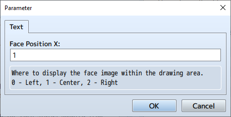
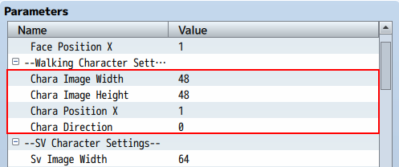
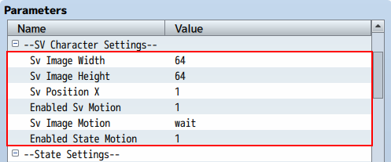
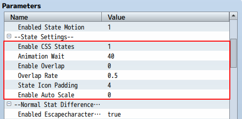
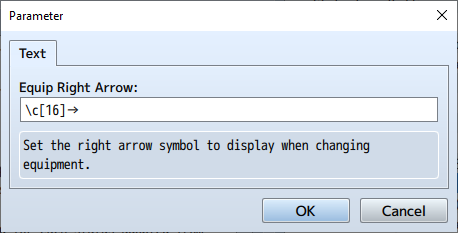
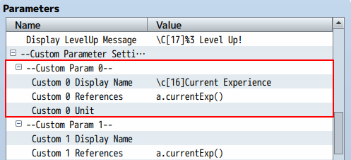
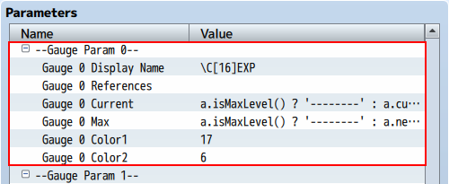
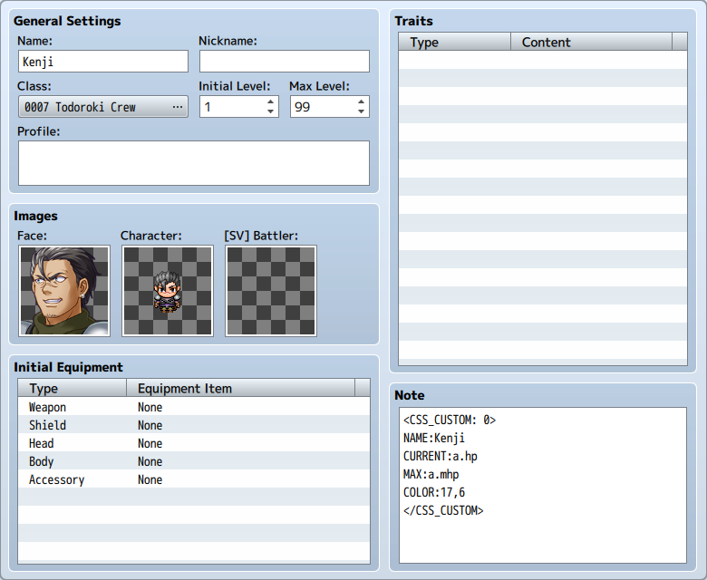
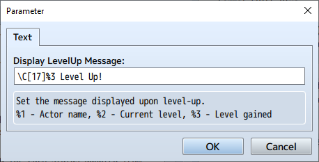

[Return to Top Page](README.md)  
[Return to Table of Contents](FTKR_CustomSimpleActorStatus.md#目次)

# Status Display

1. [Face Image Display](#face-image-display)
2. [Character Image Display](#character-image-display)
3. [SV Battle Character Image Display](#sv-battle-character-image-display)
4. [State Icon Display](#state-icon-display)
5. [Parameter Difference Display](#parameter-difference-display)
5. [Equipment Parameter Display](#equipment-parameter-display)
5. [AOP Equipment Parameter Display](#aop-equipment-parameter-display)
5. [Custom Parameter Display](#custom-parameter-display)
6. [Custom Gauge Display](#custom-gauge-display)
7. [Custom Image Display](#custom-image-display)
6. [Actor-Specific Custom Gauge Display](#actor-specific-custom-gauge-display)
6. [Class-Specific Custom Gauge Display](#class-specific-custom-gauge-display)
6. [Message Display](#message-display)

## Face Image Display

When entering the code `face` or `face(x)`, the actor's face image will be displayed.

The face image displayed with the code `face` is, by default in MV, 144*144 in size.  
Since one line is set to 36 pixels, 4 lines are required to display it at double size.

Using `face(x)` will compress or expand the face image to fit within `x` lines.

The image below shows the display using `face(3)`. The face image fits within 3 lines, allowing additional status elements like TP gauge to be added below.


The face image cannot be displayed beyond the width of the drawing area.  
If the setting is 5, the required width for drawing is 180 pixels, but if the drawing area's width is less than this, the image will only expand up to the width of the drawing area.  
Please adjust the plugin parameter `Actor Status Width Rate` accordingly.

The following parameters can be used to change the settings for the face image:

`Face Position X`

Sets the position of the actor's face image within the drawing area.
* 0 - Left-aligned
* 1 - Centered (default)
* 2 - Right-aligned

This works when the width of the drawing area is larger than the display width of the face image.  
It is also effective when the drawing area is expanded using curly braces.



[Return to Top](#status-display)　　　[Return to Table of Contents](FTKR_CustomSimpleActorStatus.ja.md#目次)

## Character Image Display

When entering the code `chara`, the actor's character image (walking character) will be displayed.  
The following parameters can be used to change the settings for the character image:

`Chara Image Width`<br>
`Chara Image Height`

Sets the size of the actor's character image.  
By default, a 48*48 image is used, but if you are using a character image of a different size, please change the setting values.

`Chara Position X`

Sets the position of the actor's character image within the drawing area.
* 0 - Left-aligned
* 1 - Centered (default)
* 2 - Right-aligned

`Chara Direction`

Sets the direction of the actor's character image.
* 0 - Fixed to front (default)
* 1 - Direction of the leading player on the map



[Return to Top](#status-display)　　　[Return to Table of Contents](FTKR_CustomSimpleActorStatus.ja.md#目次)

## SV Battle Character Image Display

When entering the code `sv`, the actor's SV character image (SV battle character) will be displayed.  
The following parameters can be used to change the settings for the SV character image:

### Image Size Settings

`Sv Image Width`<br>
`Sv Image Height`

Sets the size of the actor's SV character image.  
By default, a 64*64 image is used, but if you are using a character image of a different size, please change the setting values.

### Display Position Settings

`Sv Position X`

Sets the position of the actor's SV character image within the drawing area.
* 0 - Left-aligned
* 1 - Centered (default)
* 2 - Right-aligned

### Display Motion Settings

`Enabled Sv Motion`

Sets whether to enable motion for the actor's SV character image.
* 0 - Disabled
* 1 - Enabled (default)
* 2 - Enabled except during battle

If disabled, the motion will not be displayed, and the image will be fixed to the top-left SV character image in the image file.  
In front-view mode, this is forcibly disabled.

`Sv Image Motion`

Sets the default motion to display.  
Enter the [code name](Code_List.ja.md#モーション) of the motion you want to display.

`Enabled State Motion`

Sets whether to enable state motion.
* 0 - Disabled
* 1 - Enabled (default)

If enabled, characters with abnormal states, incapacitation, or sleep will display the motion for that state.



[Return to Top](#status-display)　　　[Return to Table of Contents](FTKR_CustomSimpleActorStatus.ja.md#目次)

## State Icon Display

When entering the code `state` or `state2(x)`, the icons of the states applied to the actor can be displayed.  
The following plugin parameters can be used to configure this:

`Enable CSS States`

Sets whether to enable the plugin's dedicated drawing process for state icons.
* 0 - Disabled
* 1 - Enabled (default)

If enabled, state icons will be displayed according to the following plugin parameters.  
If disabled, MV's default drawing process will be used.

`Animation Wait`

Specifies the switching time for state icons.

`Enable Overlap`

Enables overlapping display of state icons.
* 0 - Disabled (default)
* 1 - Enabled

If enabled, icons will be overlapped to increase the number of icons that can be displayed at once.

`Overlap Rate`

When overlapping display of state icons is enabled, specifies the allowable ratio of icon size overlap.  
Set a value between 0 and 1.

`Enable Auto Scale`

Sets whether to reduce the icon size to fit the line height.
* 0 - Disabled (default)
* 1 - Enabled



### Displaying Icons Horizontally

To display icons horizontally, use the code `state`.  
If `Enable Overlap` is enabled and multiple states are applied that do not fit within the drawing area's width, the icons will be overlapped as shown in the image.


### Displaying Icons Vertically

To display icons vertically, use the code `state2(x)`.  
`x` specifies the number of lines to use for display.  
If `Enable Overlap` is enabled and multiple states are applied that do not fit within the specified number of lines, the icons will be overlapped as shown in the image.

In the image below, the following code is used to display the icons in 4 lines:
```
state2(4)
```


[Return to Top](#status-display)　　　[Return to Table of Contents](FTKR_CustomSimpleActorStatus.ja.md#目次)

## Parameter Difference Display

When entering the codes `pdiff(x)`, `ediff(x)`, `aopdiff(x)`, or `eaopdiff(x)`, the difference values of various parameters can be displayed.

The display content can be configured using the plugin parameters `Format PDIFF Plus` (for increases) and `Format PDIFF Minus` (for decreases).

Additionally, whether control characters can be used in the display content can be set using the plugin parameter `Enabled Escapecharacters By PDIFF`.
* If enabled, control characters can be used to change colors, etc., but the display will be left-aligned and ignore width.
* If disabled, control characters cannot be used, but the display will be right-aligned and fit within the specified width.

If control characters are not used to specify colors or if control characters are disabled, the difference values will be displayed in green for increases and red for decreases.

## Equipment Parameter Display

When entering the code `eparam(x)`, the parameters when the specified item is equipped can be displayed.  
`x` is a value from 0 to 7, specifying which parameter to display:
* 0 - Max HP
* 1 - Max MP
* 2 - Attack
* 3 - Defense
* 4 - Magic Attack
* 5 - Magic Defense
* 6 - Agility
* 7 - Luck

The parameter value is displayed along with a right arrow `→`, similar to the default equipment screen.

The right arrow symbol can be changed using the following plugin parameter:

`Equip Right Arrow`

Specifies the right arrow symbol to display when changing equipment.  
Control characters can be used.



[Return to Top](#status-display)　　　[Return to Table of Contents](FTKR_CustomSimpleActorStatus.ja.md#目次)

## AOP Equipment Parameter Display

When entering the code `eaop(x)`, the AOP parameters when the specified item is equipped can be displayed.

AOP parameters are original parameters created using FTKR_AddOriginalParameters.js.  
`x` specifies the parameter ID.

The parameter value is displayed along with a right arrow `→`, similar to the default equipment screen.

This code requires FTKR_AddOriginalParameters.js.

[Return to Top](#status-display)　　　[Return to Table of Contents](FTKR_CustomSimpleActorStatus.ja.md#目次)

## Custom Parameter Display

When entering the code `custom(x)`, the parameter set in the plugin parameter `Custom Param x` can be displayed.  
Up to 20 custom parameters can be set.

### Parameter Settings

`Custom x Display Name`

Sets the display name of the parameter.  
Control characters can be used in the display name.

`Custom x References`

Sets the reference for the parameter's value using an eval formula.

`Custom x Unit`

Sets the unit of the parameter's value.  
Control characters can be used in the unit.

### About Eval Formulas

Eval formulas allow the use of values other than fixed values by entering a formula, similar to damage formulas. The following codes can be used:
* a.param - References the actor's parameters. (a.hit for the actor's hit rate)
* v[x]    - References the value of variable ID x.
* s[x]    - References the value of switch ID x.

For percentage values like hit rate, if `a.hit` is written as is, it will be displayed as a decimal.  
Therefore, it should be written as follows to convert it to an integer:
```
a.hit * 100
a.hit.percent()
```



[Return to Top](#status-display)　　　[Return to Table of Contents](FTKR_CustomSimpleActorStatus.ja.md#目次)

## Custom Gauge Display

When entering the code `gauge(x)`, the gauge set in `Gauge Param x` can be displayed.  
Up to 10 custom gauges can be set.

### Common Settings

`Gauge Param Digit`

Sets the display width of the current and maximum values to the specified number of digits.  
If the value exceeds this number of digits, it will be compressed horizontally.

### Individual Parameter Settings

`Gauge x Display Name`

Sets the display name of the gauge.  
Control characters can be used in the display name.  
If no display name is set, the current and maximum values of the gauge will not be displayed.

`Gauge x References`

Sets the reference for the gauge's value using an eval formula.  
If this value is set, the current and maximum values will not be displayed.

`Gauge x Current`

Sets the reference for the gauge's current value using an eval formula.

`Gauge x Max`

Sets the reference for the gauge's maximum value using an eval formula.  
The maximum value will not be displayed if the drawing area's width is insufficient.

`Gauge x Color1`<br>
`Gauge x Color2`

Sets the colors of the gauge.  
By changing the values of color1 and color2, the gauge can be displayed with a gradient, similar to the HP gauge.  
Setting -1 will hide the gauge bar.

### About Eval Formulas

Eval formulas allow the use of values other than fixed values by entering a formula, similar to damage formulas. The following codes can be used:
* a.param - References the actor's parameters. (a.hit for the actor's hit rate)
* v[x]    - References the value of variable ID x.
* s[x]    - References the value of switch ID x.

For percentage values like hit rate, if `a.hit` is written as is, it will be displayed as a decimal.  
Therefore, it should be written as follows to convert it to an integer:
```
a.hit * 100
a.hit.percent()
```

The plugin includes a default experience gauge (gauge 0) based on the current EXP and next level's EXP.  
Please refer to this when creating custom gauges.



[Return to Top](#status-display)　　　[Return to Table of Contents](FTKR_CustomSimpleActorStatus.ja.md#目次)

## Custom Image Display

When entering the code `image` or `image(x)`, an image set in the actor's note field can be displayed.

* `image` - Displays the first registered image.
* `image(x)` - Specifies the image in the order of registration with x = 0,1,2,...


### Note Field Settings

Use the following tags to set the image:
```
<CSS_画像:画像名>
code
</CSS_画像>
```
or
```
<CSS_IMAGE:imagename>
code
</CSS_IMAGE>
```
Enter the name of the image you want to display.<br>
The image should be saved in the /img/picture/ folder of the project.  
Different image names allow multiple images to be set.

#### Tags Available in Code

The following tags can be used to crop the image into a rectangle (trimming).  
If not set, the image will be displayed as is.

`Bgi offset X: n`

Sets the X coordinate `n` of the top-left corner for cropping the image file.  
If not specified, it defaults to 0.

`Bgi offset Y: n`

Sets the Y coordinate `n` of the top-left corner for cropping the image file.  
If not specified, it defaults to 0.

`Bgi width: n`

Sets the width `n` for cropping the image file.  
If not specified, it defaults to the image's size.

`Bgi height: n`

Sets the height `n` for cropping the image file.  
If not specified, it defaults to the image's size.

`Bgi scale: n`

Sets the scaling percentage (%) for displaying the image file.  
If not specified, it defaults to the original size (100%).

### Plugin Parameter Settings

The following parameters can be used to change the settings for custom images:

`Image Position X`

Sets the position of the custom image within the drawing area.
* 0 - Left-aligned
* 1 - Centered (default)
* 2 - Right-aligned

This works when the width of the drawing area is larger than the display width of the custom image.  
It is also effective when the drawing area is expanded using curly braces.

### Plugin Commands for Custom Images

The set custom image can be changed during the game using the following plugin command:<br>
※[] are not used in actual input

```
CSS_カスタム画像変更 [アクター または パーティー] [アクターID または パーティー順番] [カスタム画像ID] [画像名] [X座標] [Y座標] [幅] [高さ] [拡大率]
CSS_CHANGE_CUSTOM_IMAGE [ACTOR or PARTY] [actorID or partyNumber] [customImageID] [imageName] [offsetX] [offsetY] [width] [height] [scale]
```

`アクター または パーティー(ACTOR or PARTY)`<br>
Selects the method for specifying the target actor.<br>
Enter one of the following strings.

   `アクターID または パーティー順番(actorID or partyNumber)`<br>
     Enter the actor ID or party number according to the method set above.<br>
       Note that the party number starts with 0 for the first character.<br>
       \v[n] can be used to specify a variable.

   `カスタム画像ID(customImageID)`<br>
     Sets the custom image ID to change.<br>
       \v[n] can be used to specify a variable.

   `画像名(imageName)`<br>
     Sets the image file name as a string.<br>
       The image should be saved in the /img/pictures/ folder of the project.

Note that this file is not included in the "Exclude unused files" deployment option.<br>
Please take measures to avoid this, such as registering the image as a picture in an event.

   `X座標(offsetX)`<br>
   `Y座標(offsetY)`<br>
   `幅(width)`<br>
   `高さ(height)`<br>
   `拡大率(scale)`<br>
     Changes the display settings of the image file.<br>
       Same as the settings in the actor's note field.<br>
       Enter -1 to leave unchanged.<br>
       \v[n] can be used to specify a variable.<br>

Example:
```
◆Plugin Command: CSS_カスタム画像変更 アクター 1 0 Package1_2 -1 -1 -1 -1 50
```
This command changes the custom image ID 0 of actor ID 1 to /img/pictures/Package1_2.png, leaving the trimming size unchanged and setting the scaling to 50%.

[Return to Top](#status-display)　　　[Return to Table of Contents](FTKR_CustomSimpleActorStatus.ja.md#目次)

## Actor-Specific Custom Gauge Display

When entering the code `agauge(x)`, a gauge set in the actor's note field can be displayed.  
Actors without a note field setting will display a blank.


### Note Field Settings

Use the following tags to set the gauge:
```
<CSS_カスタム: x>
code
</CSS_カスタム>
```
or
```
<CSS_CUSTOM: x>
code
</CSS_CUSTOM>
```
Sets the gauge to display with the code `agauge(x)`.  
The display width of the current and maximum values uses the custom gauge settings.

### Tags Available in Code
```
表示名: y
NAME: y
```
Sets the display name of the gauge.  
Control characters can be used in the display name.  
If no display name is set, the current and maximum values of the gauge will not be displayed.

```
参照先: eval
REFERENCES: eval
```
Sets the reference for the gauge's value using an eval formula.  
If this value is set, the current and maximum values will not be displayed.

```
現在値: eval
CURRENT: eval
```
Sets the reference for the gauge's current value using an eval formula.

```
最大値: eval
MAX: eval
```
Sets the reference for the gauge's maximum value using an eval formula.  
The maximum value will not be displayed if the drawing area's width is insufficient.

```
色: y1,y2
COLOR: y1,y2
```
Sets color1 to y1 and color2 to y2 for the gauge.  
By changing the values of color1 and color2, the gauge can be displayed with a gradient, similar to the HP gauge.  
Setting -1 will hide the gauge bar.

### About Eval Formulas

Eval formulas allow the use of values other than fixed values by entering a formula, similar to damage formulas. The following codes can be used:
* a.param - References the actor's parameters. (a.hit for the actor's hit rate)
* v[x]    - References the value of variable ID x.
* s[x]    - References the value of switch ID x.

For percentage values like hit rate, if `a.hit` is written as is, it will be displayed as a decimal.  
Therefore, it should be written as follows to convert it to an integer:
```
a.hit * 100
a.hit.percent()
```



[Return to Top](#status-display)　　　[Return to Table of Contents](FTKR_CustomSimpleActorStatus.ja.md#目次)

## Class-Specific Custom Gauge Display

When entering the code `cgauge(x)`, a gauge set in the class's note field can be displayed.  
Classes without a note field setting will display a blank.

### Note Field Settings

Same as actor-specific custom gauges.

### Tags Available in Code

Same as actor-specific custom gauges.

### About Eval Formulas

Same as actor-specific custom gauges.

[Return to Top](#status-display)　　　[Return to Table of Contents](FTKR_CustomSimpleActorStatus.ja.md#目次)

## Message Display

When entering the code `message`, the following messages can be displayed according to the actor's state changes.

### Actor Level Up

When an actor levels up, a level-up message is displayed.  
The message content is set in the plugin parameter `Display LevelUp Message`.  
Control characters can be used in the message.



[Return to Top](#status-display)　　　[Return to Table of Contents](FTKR_CustomSimpleActorStatus.ja.md#目次)
